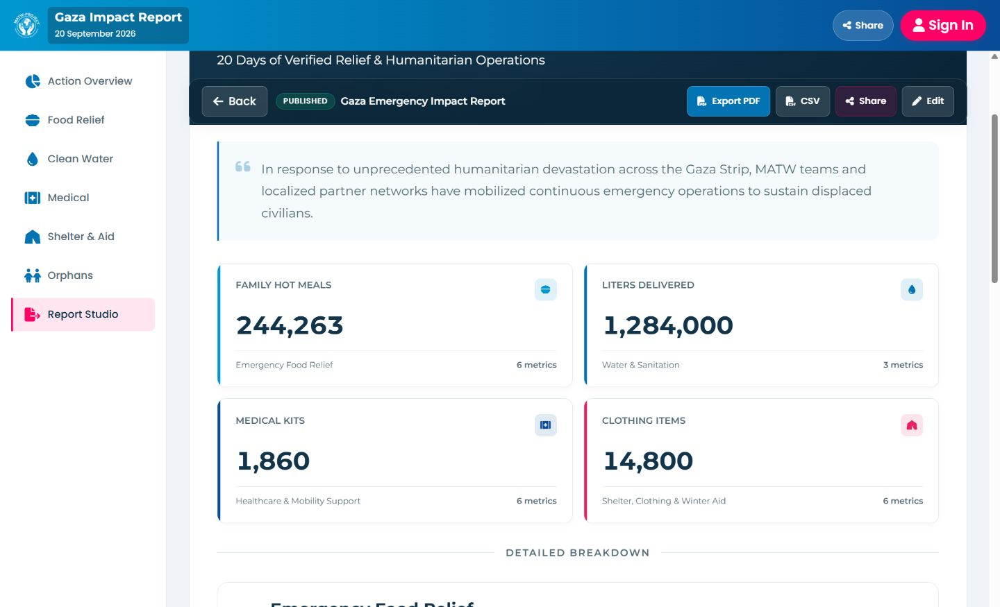
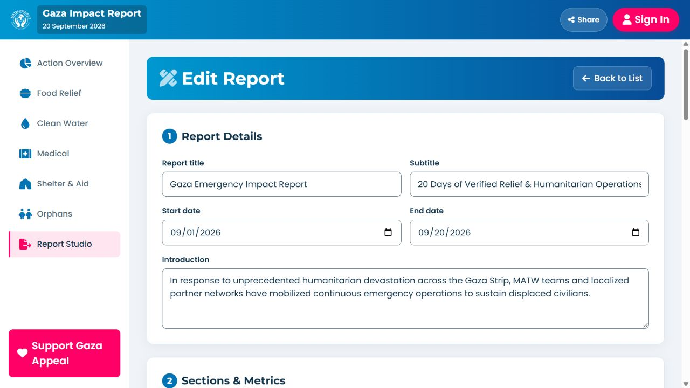

# MATW visual review

Reviewed on 7 October 2026 against the live [MATW homepage](https://matwproject.org/).

The visual direction retains the existing blue gradient, pink accents, navy report banners, white surfaces, Montserrat/Poppins typography, logos and photographs. No asset files or report dataset values were changed.

## Improvements

- Report KPIs use balanced one-, two- and four-column layouts, readable numbers, category icons and complete section labels. Metric counts no longer use upward arrows that suggest growth.
- The report editor uses white panels, distinct section groups, labeled metric/value fields, readable input borders and responsive columns.
- Explicit light text fixes dark-surface contrast in the report toolbar, editor header, photograph caption, footer and share dialog. Status labels and Share actions retain their colored backgrounds with readable text.
- Detail tables have visible row separators and aligned numeric columns.
- Navigation spacing now resolves correctly; mobile navigation sits above the sign-in panel. Keyboard focus rings and larger control targets are present.
- View changes reset the actual scrolling container. Removed JavaScript entrance animations that could leave reports or dialogs invisible in background tabs.
- PDF export uses a white content surface with dark text while retaining navy header/footer banners.

## Verification

- Report: 320px, 390px, 820px, 1440px and 1920px viewport checks; no measured horizontal overflow in the inspected report, KPI, table or toolbar containers. Confirmed four KPI columns at 1920px.
- Form: desktop, 390px and 320px checks; no measured horizontal overflow in the inspected panels or metric rows.
- Overview and all five category screens: 320px overflow and solid-background text contrast checks passed.
- Solid-background contrast checks passed for the inspected report, form and sign-in screens after fixes. These checks compose translucent background colors; gradients and photographs were inspected visually and are not included in the calculated pass count. This is not a full accessibility certification.
- Mobile navigation tested from the sign-in screen; drawer controls remain visible and usable.
- Share dialog visually checked at desktop/tablet and 320px; opened and closed successfully. No messages were sent.
- PDF export returned “PDF downloaded successfully.” Exported PDF pagination was not visually audited.
- JavaScript syntax and git whitespace checks passed. No browser console errors were present in the final preview.

## Scope

This review addresses presentation and responsive behavior. It does not certify backend security, authentication or production readiness. Existing uncommitted image-manager markup in index.html was preserved; that unfinished manager was not connected as part of this visual pass.

The earlier source-only concern about a missing tablet menu was incorrect: the hamburger is visible at 820px, as confirmed in the browser.

## Previews

